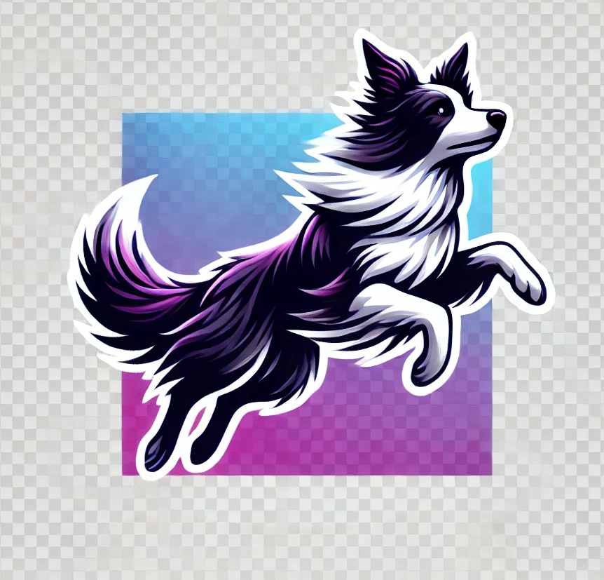

<h3 align="center">kollie</h3>

An Android-first, 2D/3D rendering engine for Jetpack Compose, ARCore + Android XR

<!-- ABOUT THE PROJECT -->
## About kollie (*under heavy construction*)

* Focused on procedurally generated 2D/3D UI for on-device workflows.
* Written in Kotlin & c++, using Jetpack Compose, Android NDK + JNI.
* Built on OpenGL ES, designed for real-time and event-driven rendering.
* Entity-component architecture for extensibility and ease-of-use

(<a href="#readme-top">back to top</a>)

### Built With

* Android Studio
* Jetpack Compose
* Android NDK
* Kotlin
* c++

(<a href="#readme-top">back to top</a>)

<!-- GETTING STARTED -->
## Getting Started

kollie is under heavy construction - check back soon for more info!

<!-- LICENSE -->
## License

Distributed under the MIT License. See `LICENSE.txt` for more information.

(<a href="#readme-top">back to top</a>)

<!-- CONTACT -->
## Contact

Danrae Pray - [Twitter](https://x.com/DanraeP) - [LinkedIn](https://www.linkedin.com/in/danraepray/)

(<a href="#readme-top">back to top</a>)

<!-- MARKDOWN LINKS & IMAGES -->
<!-- https://www.markdownguide.org/basic-syntax/#reference-style-links -->

[android-studio]: https://developer.android.com/studio

[jetpack-compose]: https://developer.android.com/compose

[android-ndk]: https://developer.android.com/ndk

[kotlin]: https://developer.android.com/kotlin

[cpp]: https://developer.android.com/ndk